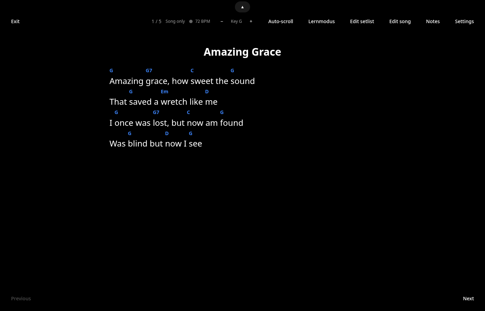
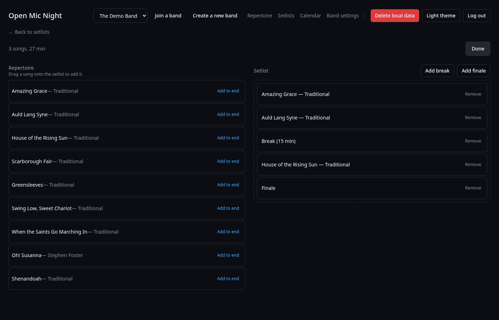
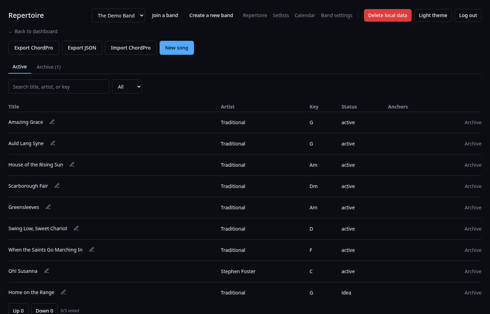
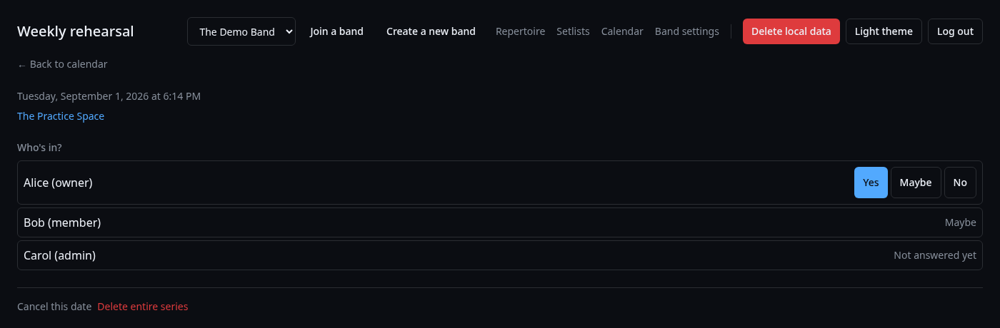
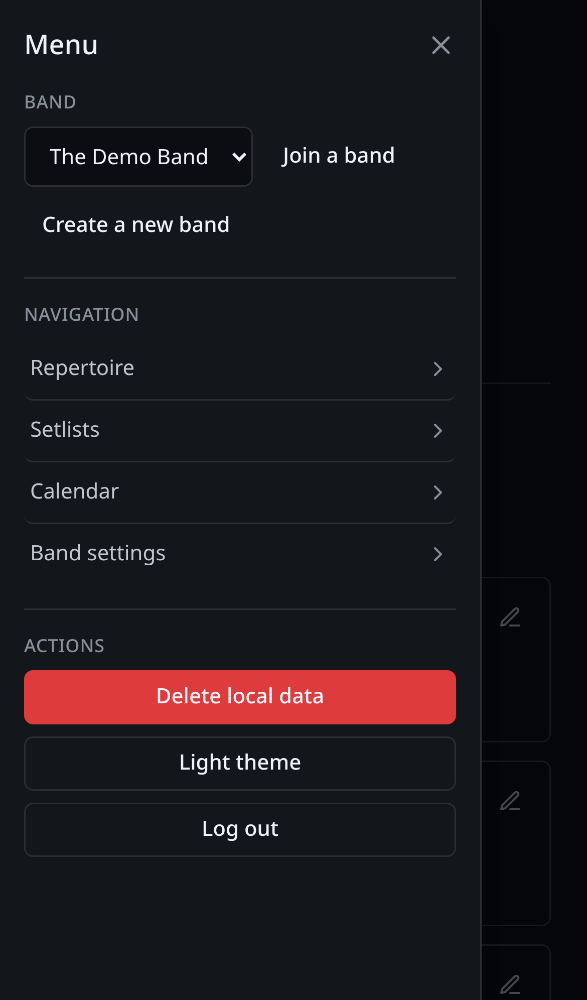

# Bandstand

A free, open-source workspace for amateur and semi-pro bands — repertoire,
setlists, and the show itself, in one place instead of scattered across
paper, PDFs, and group chats.

> **Status:** Milestones 1–3 are functional — bands and invites,
> repertoire (multi-voice songs, including scanned/PDF parts), setlists,
> Stage Mode with Follow Mode, calendar events with availability
> responses, scheduling polls, and push notifications. Not yet released
> as a versioned build; offline caching for file attachments is still in
> progress. See [docs/ARCHITECTURE.md](docs/ARCHITECTURE.md) and the
> [ADRs](docs/adr/) for the reasoning behind how it's built.











## Why Bandstand

Commercial tools in this space (BandHelper, OnSong, BandUp, …) are solid but
come with seat limits, subscriptions, and — the most common complaint —
feature bloat. Bandstand is built around four constraints instead:

1. **Offline-first and open source** — your band's data is yours; the app
   can't be discontinued out from under you.
2. **Stage sync without internet** — any device on the LAN can run the sync
   server itself.
3. **No seat limits, no forced subscription** — self-host with
   `docker compose up`.
4. **Simple** — a shallow learning curve is a feature, not a gap. Avoiding
   feature bloat is this project's most important non-goal.

## Tech stack

TypeScript everywhere in a pnpm + Turborepo monorepo. React 19 / Vite /
Tailwind CSS v4 / shadcn/ui for the frontend, Zustand for UI state and Yjs
for shared/collaborative data, ChordPro (via `chordsheetjs`) for chord
charts. Capacitor and Tauri v2 wrap the same web build for mobile and
desktop — no feature logic lives in those wrappers. The backend is Node 22
+ Hono + Zod, PostgreSQL 16 + Drizzle ORM, Hocuspocus for realtime sync, and
better-auth for authentication. See [docs/ARCHITECTURE.md](docs/ARCHITECTURE.md)
for the full picture.

## Getting started

```bash
git clone https://github.com/bandstandhq/bandstand.git
cd bandstand
pnpm install && pnpm dev
```

(`pnpm dev` creates `.env` from `.env.example` on first run if it doesn't
exist yet — no manual setup needed.)

That brings up Postgres and Mailpit in Docker, applies migrations, and
starts the web app and server. See [CONTRIBUTING.md](CONTRIBUTING.md) for
the full contributor setup, including seeding demo data with `pnpm seed`.
For what each band role (owner/admin/member) can do, see
[docs/PERMISSIONS.md](docs/PERMISSIONS.md).

## Licensing

Bandstand uses a deliberate split, by directory:

| Path | License |
| --- | --- |
| `apps/server/**` | AGPL-3.0-or-later |
| everything else (`apps/web`, `apps/mobile`, `apps/desktop`, `packages/**`) | Apache-2.0 |

- **Clients are Apache-2.0** so they can be distributed through app stores
  without copyleft friction (the App Store and Play Store terms don't play
  well with strong copyleft licenses on client binaries).
- **The server is AGPL-3.0-or-later** so that anyone who runs a modified
  version of it as a network service has to share those modifications —
  closing the "hosted SaaS fork" loophole that plain copyleft licenses
  don't cover.

Full texts: [LICENSE-APACHE](LICENSE-APACHE), [LICENSE-AGPL](LICENSE-AGPL).
Contributions are covered by our [CLA](docs/CLA.md).

### Trademark

The "Bandstand" name and logo are **not** covered by either license above —
they remain unlicensed trademarks of bandstandhq. You're free to fork and
redistribute the code under its license, but forks should use a different
name/logo unless you have explicit permission to use ours.

## Contact

See [docs/CONTACT.md](docs/CONTACT.md).
